# 🕌 Masjid Salahuddin - Sistem Informasi Terpadu

[](https://laravel.com)
[](https://www.php.net)
[](#lisensi)
[](#)

Sistem informasi terpadu yang dirancang khusus untuk mendukung pengelolaan operasional, administrasi, dan layanan digital di Masjid Salahuddin. Aplikasi ini mengintegrasikan berbagai aspek manajemen masjid dalam satu platform yang mudah digunakan dan responsif.

---

## 📋 Daftar Isi

- [📸 Tangkapan Layar (Screenshots)](#-tangkapan-layar-screenshots)
- [✨ Fitur Utama](#-fitur-utama)
- [🛠️ Teknologi & Stack](#️-teknologi--stack)
- [📁 Struktur Proyek](#-struktur-proyek)
- [🚀 Panduan Setup](#-panduan-setup)
- [📖 Dokumentasi](#-dokumentasi)
- [🤝 Kontribusi](#-kontribusi)
- [📄 Lisensi](#-lisensi)

---

## 📸 Tangkapan Layar (Screenshots)

Berikut adalah galeri antarmuka sistem informasi terpadu Masjid Salahuddin:

### 🌐 1. Portal Jamaah & Tampilan Responsif (PWA)
Portal publik yang dapat diakses oleh jamaah melalui peramban web desktop maupun smartphone secara responsif sebagai Progressive Web App (PWA).

| Portal Beranda Jamaah (Desktop) | Tampilan Responsif Smartphone & PWA |
|:---:|:---:|
| 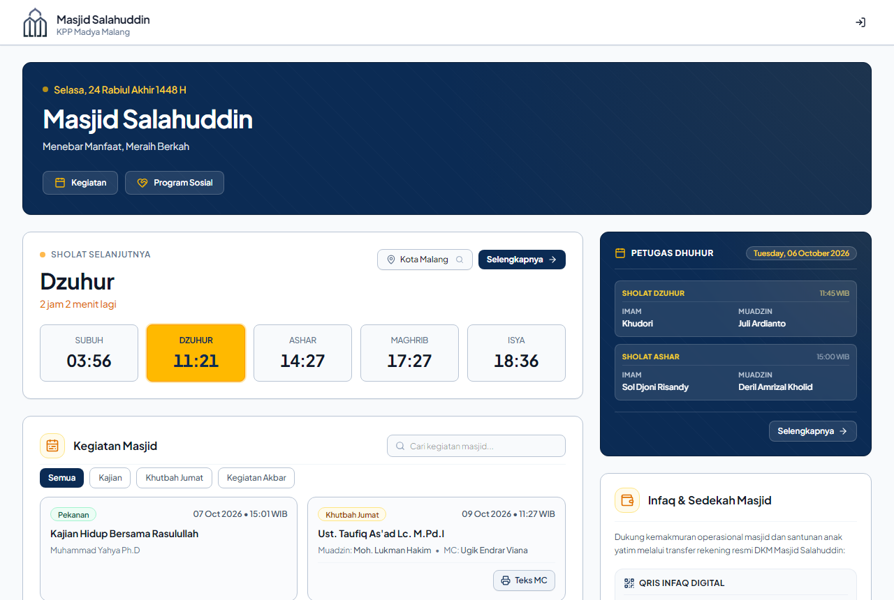 | 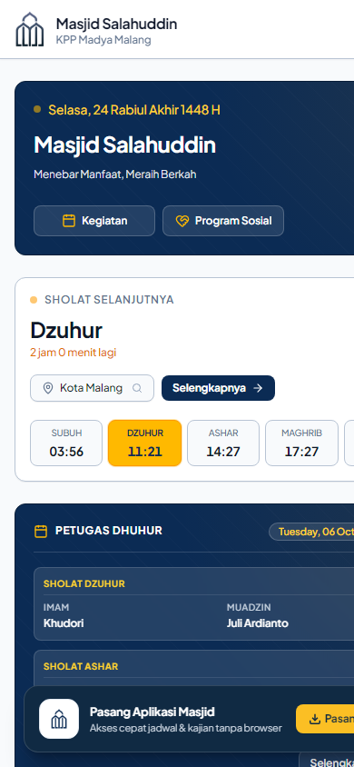 |

---

### ⏰ 2. Jadwal Shalat Bulanan & Roster Petugas
Perhitungan waktu sholat otomatis dengan metode hisab Kemenag RI untuk wilayah Kota Malang, serta penugasan petugas imam & muadzin harian dan khotib Shalat Jumat.

| Jadwal Waktu Shalat Bulanan | Roster Petugas Shalat Bulanan |
|:---:|:---:|
| 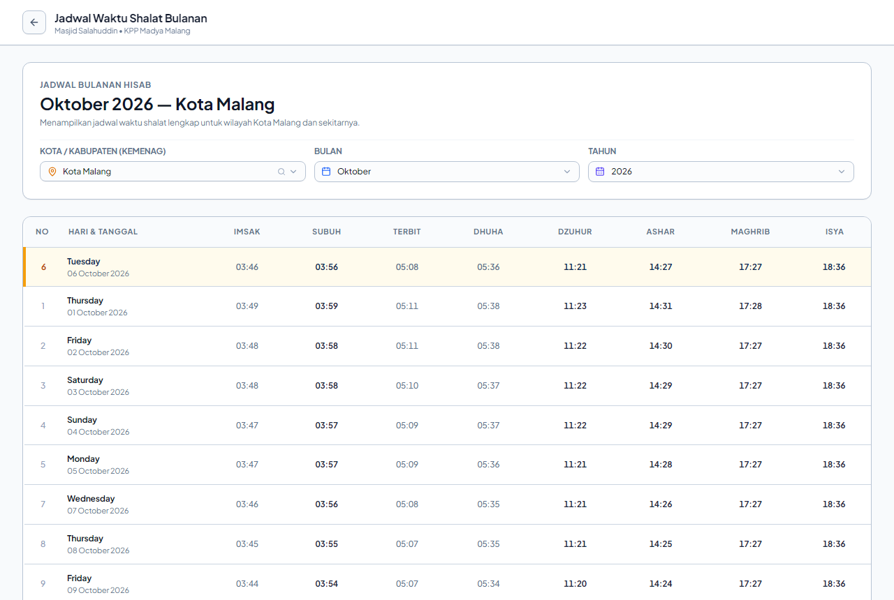 | 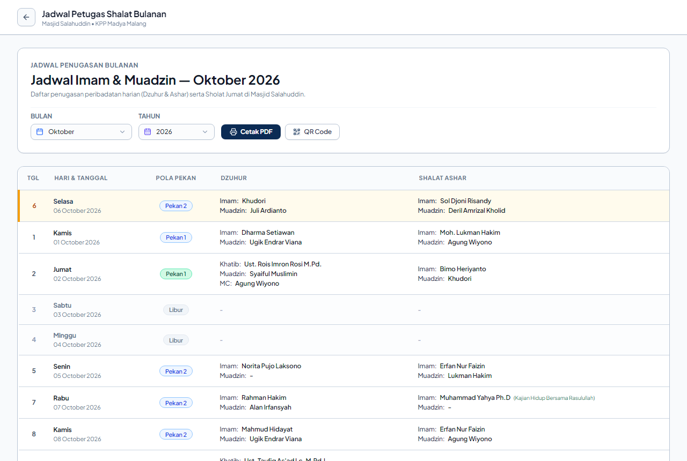 |

---

### 📅 3. Kalender Kegiatan & Kotak Saran Aspirasi
Daftar kegiatan rutin, kajian pekanan/tematik, dan Shalat Jumat, dilengkapi kotak aspirasi dua arah dengan transparansi tindak lanjut resmi dari Takmir DKM.

| Kalender Kegiatan & Kajian Masjid | Kotak Saran & Tindak Lanjut Aspirasi |
|:---:|:---:|
| 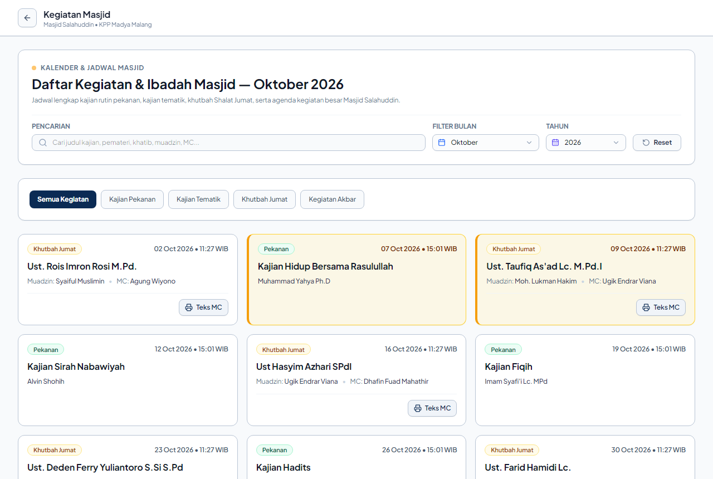 | 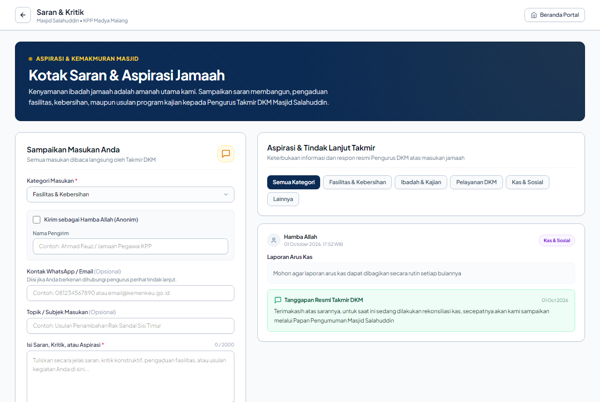 |

---

### 🏛️ 4. Profil Masjid, Legalitas SK & Galeri Kegiatan
Informasi profil identitas masjid, struktur pengurus berdasarkan Surat Keputusan (SK) resmi, serta galeri dokumentasi foto kegiatan peribadatan dan sosial.

| Profil Masjid & Visi-Misi | Struktur Pengurus & Dokumen SK Resmi |
|:---:|:---:|
| 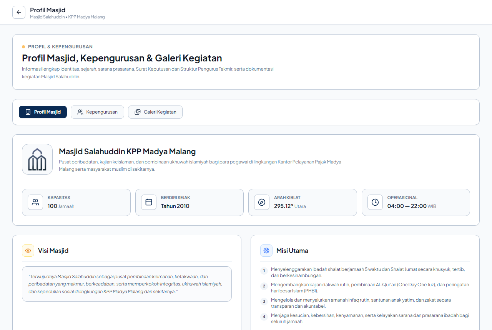 | 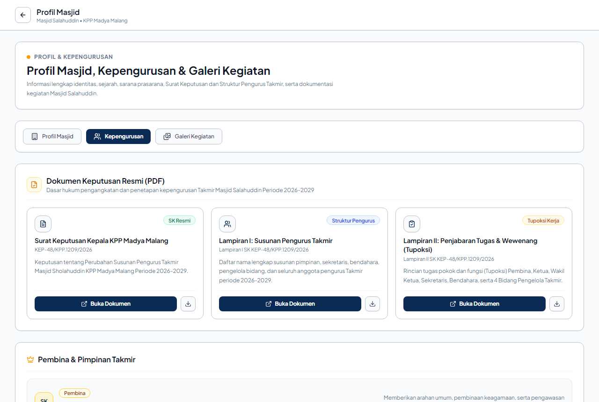 |

| Dokumentasi Galeri Kegiatan Masjid |
|:---:|
| 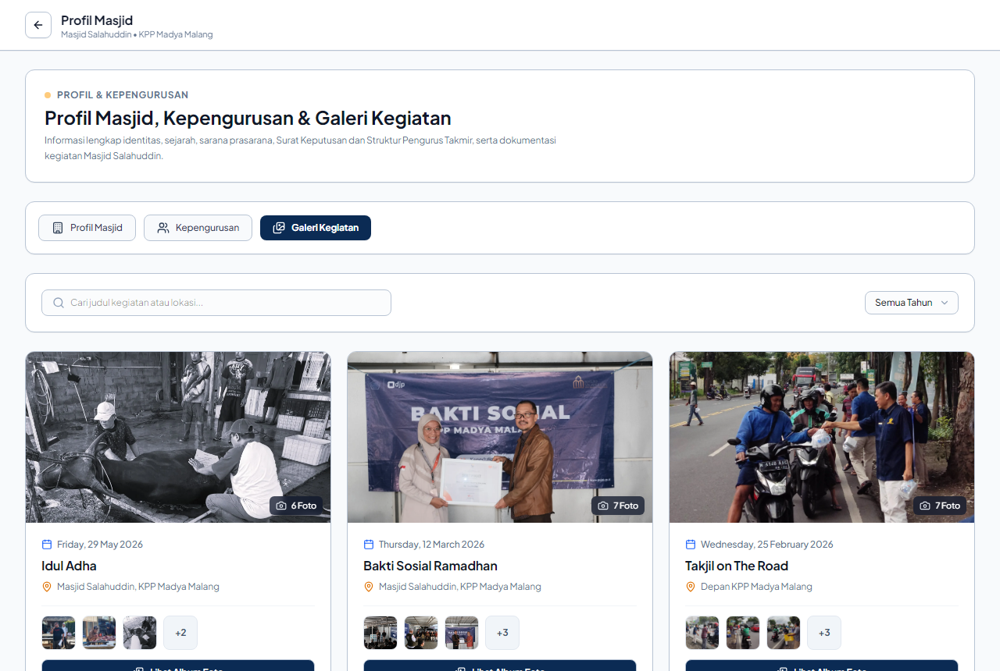 |

---

### 📺 5. Digital Signage — Layar TV Display Masjid
Tampilan khusus monitor TV masjid (Full HD 1080p landscape) dengan jam digital hisab akurat, hitung mundur menuju adzan & iqomah, running text pengumuman, serta parameter cuaca BMKG.

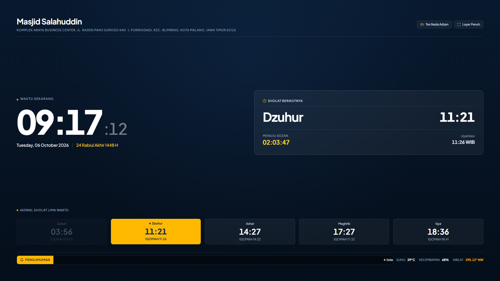

---

### 🔐 6. Autentikasi & Registrasi Pengurus DKM
Keamanan akses modul administratif khusus takmir dengan integrasi verifikasi alamat email kedinasan resmi Direktorat Jenderal Pajak (`@pajak.go.id`).

| Masuk Pengurus DKM | Pendaftaran Akun Email Kedinasan |
|:---:|:---:|
| 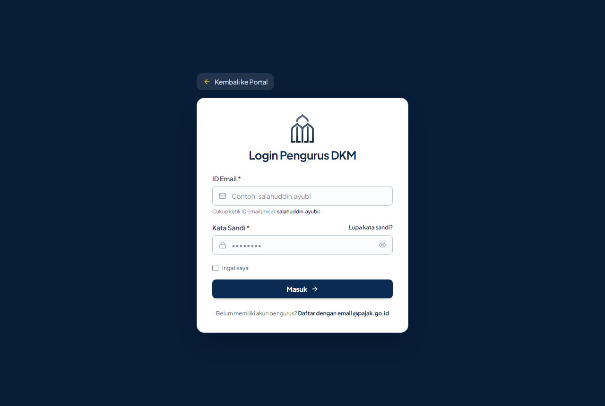 | 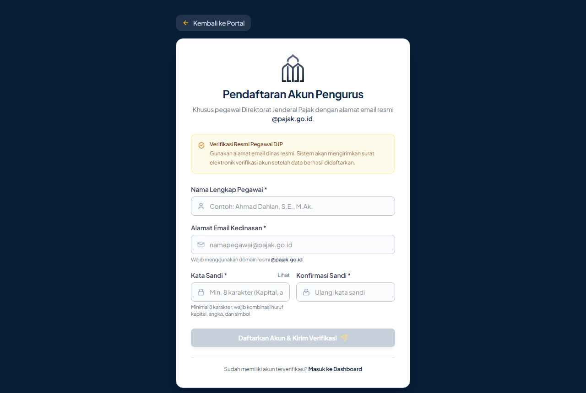 |

---

## ✨ Fitur Utama

### 👥 Portal Jamaah
- Informasi profil dan identitas masjid
- Jadwal dan agenda kegiatan terbaru
- Katalog kajian dan penceramah
- Berita dan artikel informatif

### ⏰ Manajemen Jadwal Sholat
- Perhitungan waktu sholat otomatis dan akurat
- Waktu imsak untuk puasa
- Pemberitahuan adzan terintegrasi
- Countdown iqomah real-time

### 👔 Manajemen Petugas Sholat
- Roster jadwal imam, muadzin, dan khotib
- Pengaturan giliran petugas sholat
- Riwayat dan notifikasi tugas
- Manajemen kontak petugas

### 📺 TV Display (Digital Signage)
- Tampilan khusus untuk monitor/TV masjid
- Jam digital dengan desain modern
- Countdown adzan dan iqomah
- Slide otomatis untuk kegiatan dan pengumuman

### 💰 Pelaporan Keuangan & Infaq
- Pencatatan transaksi kas masuk dan keluar
- Laporan keuangan terstruktur
- Export laporan dalam format PDF
- Dashboard transparansi keuangan

### 📱 Progressive Web App (PWA)
- Instalasi langsung di smartphone tanpa app store
- Akses cepat dan offline-capable
- Interface native-like experience
- Notifikasi push untuk reminder penting

### 💭 Kotak Saran & Aspirasi
- Saluran komunikasi jamaah dengan takmir
- Manajemen feedback dan pengaduan
- Prioritas dan status follow-up
- Transparansi respon takmir

### 🔐 Dashboard Admin Takmir
- Panel kontrol manajemen terpusat
- Kelola semua konten dan data
- Manajemen pengguna dan akses
- Pengaturan sistem dan konfigurasi

---

## 🛠️ Teknologi & Stack

| Komponen | Teknologi | Versi |
|----------|-----------|-------|
| **Backend Framework** | [Laravel](https://laravel.com/) | 11.x |
| **Language** | PHP | 8.2+ |
| **Frontend Reactivity** | [Livewire](https://livewire.laravel.com/) & [Alpine.js](https://alpinejs.dev/) | Latest |
| **Build Tool** | [Vite](https://vitejs.dev/) | 8.x |
| **Styling** | Blade + Tailwind CSS | - |
| **Database** | MySQL / MariaDB | 8.0+ / 10.5+ |
| **Web Server** | Nginx + OpenResty | Latest |
| **Control Panel** | 1Panel | - |

---

## 📁 Struktur Proyek

```
.
├── app/
│   ├── Http/Controllers/          # Controller untuk setiap fitur
│   ├── Livewire/                  # Komponen Livewire reaktif
│   ├── Models/                    # Model database (Eloquent ORM)
│   └── Services/                  # Business logic & services
├── config/                         # Konfigurasi aplikasi
├── database/
│   ├── migrations/                # Schema database
│   ├── seeders/                   # Data awal
│   └── factories/                 # Test data factory
├── docs/                           # 📚 Dokumentasi & Aset Pendukung
│   ├── ARCHITECTURE.md            # Panduan arsitektur sistem
│   ├── SETUP.md                   # Panduan setup & instalasi
│   ├── LIVEWIRE_ALPINE_...        # Panduan sinkronisasi state
│   └── screenshots/               # 📸 Tangkapan layar antarmuka sistem
├── public/                         # Public web root
│   ├── manifest.json              # PWA manifest
│   ├── sw.js                      # Service worker
│   └── assets/                    # CSS, JS, images
├── resources/
│   ├── views/                     # Blade template views
│   ├── css/                       # Stylesheet
│   └── js/                        # JavaScript
├── routes/
│   ├── web.php                    # Web routes
│   └── api.php                    # API routes
├── tests/                         # Feature & Unit tests
├── .env.example                   # Environment template
├── composer.json                  # PHP dependencies
└── package.json                   # Node dependencies
```

---

## 🚀 Panduan Setup

### 📋 Prasyarat

Pastikan sudah terinstal:
- **PHP** >= 8.2 dengan ekstensi: `pdo_mysql`, `mbstring`, `openssl`, `gd`/`imagick`, `fileinfo`
- **Composer** (PHP dependency manager)
- **Node.js** >= 18 & **NPM**
- **MySQL** atau **MariaDB** (versi 8.0+ / 10.5+)
- **Git** untuk version control

**Rekomendasi Setup Lokal:**
- [Laragon](https://laragon.org/) (Windows - All-in-one)
- [Herd](https://herd.laravel.com/) (macOS - Laravel optimized)
- [Docker](https://www.docker.com/) (Cross-platform)

---

### ⚡ Langkah Instalasi

#### 1️⃣ Clone Repository
```bash
git clone https://github.com/dhafinfuad/masjid-salahuddin.git
cd masjid-salahuddin/index
```

#### 2️⃣ Instalasi Backend Dependencies
```bash
# Salin environment file
cp .env.example .env

# Instalasi PHP dependencies
composer install
```

#### 3️⃣ Konfigurasi Database
Edit file `.env` dan atur koneksi database:
```env
DB_CONNECTION=mysql
DB_HOST=127.0.0.1
DB_PORT=3306
DB_DATABASE=masjid_salahuddin
DB_USERNAME=root
DB_PASSWORD=
```

#### 4️⃣ Setup Application
```bash
# Generate application key
php artisan key:generate

# Jalankan database migration & seeding
php artisan migrate --seed
```

#### 5️⃣ Instalasi Frontend Dependencies
```bash
# Instalasi Node packages
npm install

# Build assets (development)
npm run dev

# Atau build production
npm run build
```

#### 6️⃣ Jalankan Development Server
```bash
php artisan serve
```

Aplikasi akan berjalan di **`http://localhost:8000`**

---

### 🔑 Credentials Default (Setelah Seeding)

Untuk login pertama kali ke dashboard admin:
- **Email**: `admin@masjidsalahuddin.id`
- **Password**: `password`

⚠️ **Penting**: Ganti password setelah login pertama kali!

---

## 📖 Dokumentasi

### Panduan Pengembang
- [Setup Lokal & Development](./docs/SETUP.md) - Panduan detail setup
- [Arsitektur Sistem](./docs/ARCHITECTURE.md) - Panduan arsitektur sistem
- [Sinkronisasi Livewire & Alpine](./docs/LIVEWIRE_ALPINE_STATE_SYNC_GUIDELINES.md) - Panduan sinkronisasi reaktif

---

## 🧪 Testing

Jalankan test suite untuk memastikan kualitas kode:

```bash
# Jalankan semua test
php artisan test

# Test dengan coverage report
php artisan test --coverage
```

---

## 🔐 Keamanan

### Best Practices yang Diterapkan
- ✅ Input validation & sanitization
- ✅ SQL injection prevention (Eloquent ORM)
- ✅ CSRF protection (Laravel CSRF token)
- ✅ Password hashing (bcrypt)
- ✅ Rate limiting untuk API & login
- ✅ Environment variable untuk secrets

---

## 🤝 Kontribusi

Kami menerima kontribusi dari komunitas! Silakan buat Pull Request atau ajukan Issue jika menemukan kendala.

---

## 📄 Lisensi

Hak Cipta © 2026 Masjid Salahuddin. Semua hak dilindungi.

Proyek ini adalah **proprietary software** yang khusus dikembangkan untuk Masjid Salahuddin. Penggunaan, distribusi, atau modifikasi tanpa izin resmi dilarang.

---

**Dibuat dengan ❤️ untuk kemakmuran Masjid Salahuddin**
